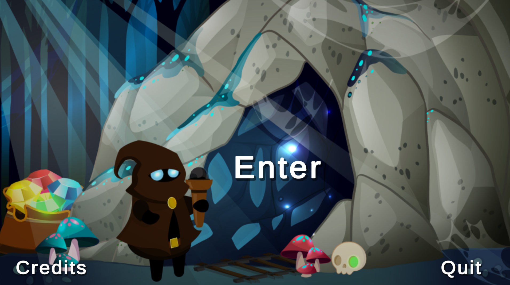
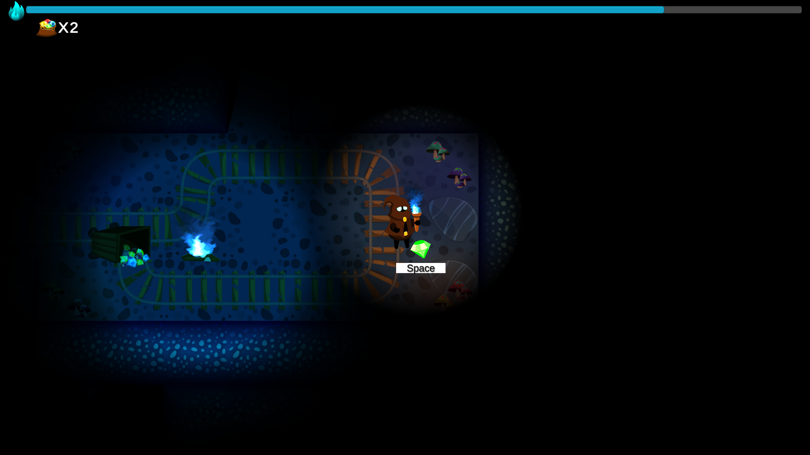

# 🔦 Light's Out

**A dark maze adventure where your only friend is your magical torch.**  
Find all the gems before your light fades away… or get lost in the darkness forever. 🕯️💎  

---

## 🎮 Gameplay
- Explore a **dark labyrinth** filled with secrets and hidden gems  
- Your **torch is your lifeline** – keep it burning by recharging at other torches or bonfires  
- Collect all gems to escape the darkness  
- Watch out: when the light goes out… so do you  

---

## 🕹️ Controls
- **WASD / Arrow Keys** → Move around  
- **SPACE** → Interact (light torches, bonfires, pick up gems)  
- **TAB** → Toggle Easy Mode (because sometimes you just need a break 😅)  

---

## 🛠️ Tech & Tools
- **Engine**: Unity  
- **Language**: C#  
- **Graphics**: Homemade + free assets  
- **Inspiration**: The fear of walking around the house at 3 AM without turning the lights on 👻  

---

## 🚀 Play the Game
You can try it directly here:  
👉 [**Play on itch.io**](https://bafritz.itch.io/lights-out)  
Or release: (see [Releases](https://github.com/emoraru/lights-out/releases/tag/v1.01))

---

## ✨ Quote
> "In Light's Out, the real monster is… your dying torch 🔥."
